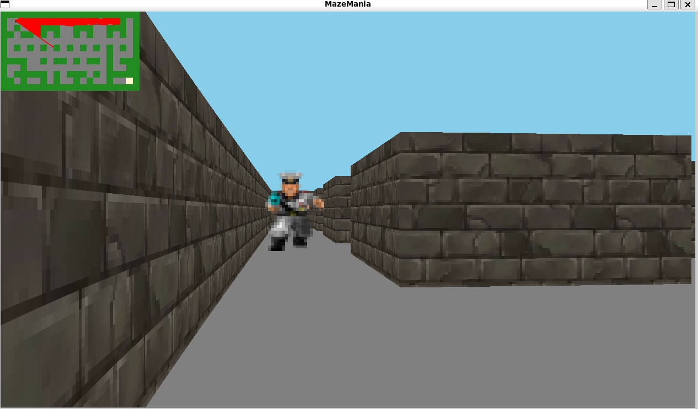

# Mazemania

Mazemania is a 3D maze exploration game built with SDL2. Navigate through increasingly challenging levels filled with enemies, and utilize the mini-map for navigation. The game is designed to offer a retro, first-person perspective.



## Features

- **Levels and Worlds**: The game consists of multiple levels, each presenting a unique and progressively challenging maze. As you advance through the levels, the complexity and number of enemies increase.
- **Mini-map**: A mini-map is available to aid in navigation. You can toggle the mini-map's visibility by pressing the `Esc` key to hide it and the `Enter` key to display it again.
- **Player Controls**:
  - **Movement**: Use the `W`, `A`, `S`, `D` keys to move forward, left, backward, and right, respectively.
  - **Rotation**: Use the left and right arrow keys to rotate the player's view.
- **Enemies**: Enemies are present in each level, adding to the challenge. They appear as sprites that grow larger as you approach them. Enemies are spawned at random points in the maze.

## Future Improvements

- **Collision Detection**: Currently, the player can pass through enemies. Implementing proper collision detection to prevent this will be a future improvement.
- **Player Weapons**: The game does not currently feature weapons for the player. Adding this functionality will be part of future development.
- **Enemy AI**: Basic enemy AI is in place, but further enhancements to make enemies more challenging and intelligent will be considered.

## How to Play

1. **Start the Game**: Launch the game executable to start playing.
2. **Navigate the Maze**: Use the movement and rotation controls to navigate through the maze.
3. **Mini-map**: Use the mini-map to aid in your navigation. Toggle its visibility with the `Esc` and `Enter` keys.

## Known Issues

- Players can currently pass through enemies.
- Player weapons have not been implemented.

## Getting Started

### Prerequisites

- SDL2 library

#### Installing SDL2

You can also provide brief instructions on how to install SDL2. This could include package manager commands for different operating systems or a link to the SDL2 website for detailed installation instructions.

### Installing SDL2

To install SDL2 library on macOS using Homebrew:

```bash
brew install sdl2
```

For Ubuntu or Debian-based Linux distributions:

```bash
sudo apt-get install libsdl2-dev
```

For Windows, download the SDL2 development libraries from the [official SDL website](https://www.libsdl.org/download-2.0.php) and follow the installation instructions.

### Building the Game

1. Clone the repository:
   ```bash
   git clone https://github.com/Faithjohnsonpage/Mazemania.git
   ```
2. Navigate to the project directory and build the project using `make`:
   ```bash
   cd Mazemania/src
   make
   ```
3. Run the game executable:
   ```bash
   ./main
   ```
4. Clean the project:
  ```bash
  make clean
  ```


## Contributing

If you'd like to contribute to Mazemania, please fork the repository and use a feature branch. Pull requests are welcome.

## License

Mazemania is licensed under the MIT License.
